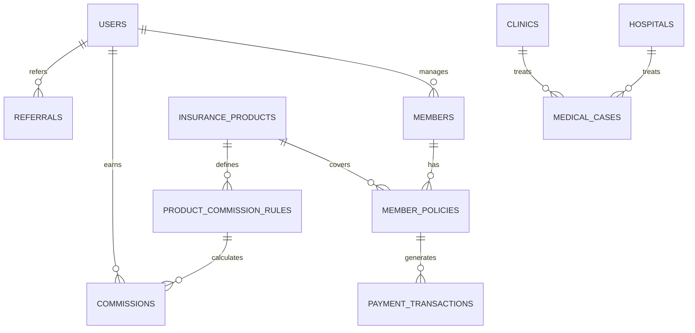

# 🏥 KH Holdings Insurance Agent Management System

<div align="center">


**Professional Insurance Agent Management System with MLM Commission Structure**

[](https://nextjs.org/)
[](https://laravel.com/)
[](https://www.typescriptlang.org/)
[](https://tailwindcss.com/)
[](https://www.docker.com/)

**Developed by:** Faiz Nasir  
**Owned By:** KH Holdings Sdn Bhd

</div>

---

## 📋 Table of Contents

- [🚀 Overview](#-overview)
- [✨ Key Features](#-key-features)
- [🏗️ System Architecture](#️-system-architecture)
- [🛠️ Technology Stack](#️-technology-stack)
- [📱 Frontend Features](#-frontend-features)
- [🔧 Backend Features](#-backend-features)
- [💾 Database Schema](#-database-schema)
- [🚀 Getting Started](#-getting-started)
- [🐳 Docker Setup](#-docker-setup)
- [📊 API Documentation](#-api-documentation)
- [🔐 Security Features](#-security-features)
- [📈 Business Logic](#-business-logic)
- [🎯 Use Cases](#-use-cases)
- [🔄 Development Workflow](#-development-workflow)
- [📝 Contributing](#-contributing)
- [📄 License](#-license)

---

## 🚀 Overview

The **KH Holdings Insurance Agent Management System** is a comprehensive, enterprise-grade platform designed to streamline insurance operations through advanced agent management, member services, and sophisticated MLM (Multi-Level Marketing) commission structures. This system serves as the backbone for insurance agents to manage their portfolios, track commissions, and provide exceptional service to policyholders.

### 🎯 **Business Purpose**
- **Agent Management**: Centralized control of insurance agents with hierarchical structures
- **Member Services**: Comprehensive policy management and customer relationship tools
- **Commission Tracking**: Advanced MLM commission calculation and distribution system
- **Healthcare Integration**: Seamless connection with hospitals, clinics, and medical facilities
- **Financial Operations**: Payment processing, mandate management, and transaction tracking

---

## ✨ Key Features

### 🎨 **Modern User Experience**
- **Responsive Design**: Mobile-first approach with seamless cross-device compatibility
- **Interactive UI**: Smooth animations, transitions, and modern design patterns
- **Real-time Updates**: Dynamic content updates without page refresh
- **Progressive Web App**: Offline capabilities and app-like experience

### 🔐 **Security & Authentication**
- **Multi-factor Authentication**: TAC (Transaction Authorization Code) verification
- **Role-based Access Control**: Granular permissions for different user types
- **Session Management**: Secure token-based authentication with Laravel Sanctum
- **Data Encryption**: Sensitive information protection and secure transmission

### 📊 **Advanced Analytics**
- **Real-time Dashboard**: Live metrics, performance indicators, and trend analysis
- **Commission Tracking**: Multi-tier MLM commission calculation and reporting
- **Performance Metrics**: Agent performance analysis and goal tracking
- **Business Intelligence**: Comprehensive reporting and data visualization

---

## 🏗️ System Architecture

### **Frontend Architecture**
```
app/
├── (ui)/components/          # Reusable UI components
├── contexts/                 # React context providers
├── services/                 # API service layer
├── dashboard/                # Agent dashboard
├── members/                  # Member management
├── profile/                  # User profile management
├── explore/                  # Product exploration
└── hospitals/clinics/        # Healthcare facility management
```

### **Backend Architecture**
```
backend/
├── app/
│   ├── Http/Controllers/     # API and Admin controllers
│   ├── Models/               # Eloquent ORM models
│   ├── Services/             # Business logic services
│   ├── Jobs/                 # Background job processing
│   └── Providers/            # Service providers
├── database/
│   ├── migrations/           # Database schema definitions
│   ├── seeders/              # Sample data population
│   └── factories/            # Model factories for testing
└── routes/                   # API and web route definitions
```

### **Database Architecture**
```
Core Tables:
├── users                     # Insurance agents with MLM structure
├── members                   # Policyholders and customers
├── insurance_products        # Available insurance products
├── member_policies           # Active insurance policies
├── commissions               # MLM commission records
├── payment_transactions      # Financial transactions
├── hospitals_clinics         # Healthcare facilities
└── medical_cases             # Claims and medical records
```

---

## 🛠️ Technology Stack

### **Frontend Technologies**
- **Next.js 15.5.2**: React framework with App Router
- **React 19.1.0**: Modern React with concurrent features
- **TypeScript 5.0**: Type-safe JavaScript development
- **Tailwind CSS 4.0**: Utility-first CSS framework
- **Framer Motion**: Advanced animation library
- **Lucide React**: Beautiful icon library

### **Backend Technologies**
- **Laravel 12.0**: PHP framework with modern features
- **PHP 8.2+**: Latest PHP with performance improvements
- **MySQL 8.0**: Robust relational database
- **Redis**: In-memory caching and session storage
- **Laravel Sanctum**: API authentication system
- **Laravel Horizon**: Queue monitoring and management

### **Infrastructure & DevOps**
- **Docker**: Containerized development and deployment
- **Nginx**: High-performance web server
- **phpMyAdmin**: Database management interface
- **Queue Workers**: Background job processing
- **Multi-container Architecture**: Scalable microservices approach

---

## 📱 Frontend Features

### **Agent Dashboard**
- **Performance Metrics**: Real-time commission tracking and goal progress
- **Member Management**: Add, edit, and manage policyholder information
- **Quick Actions**: Streamlined workflows for common tasks
- **Notification Center**: Important updates and alerts

### **Member Management**
- **Profile Management**: Comprehensive customer information storage
- **Policy Tracking**: Active policy monitoring and renewal reminders
- **Payment History**: Transaction records and payment status
- **Document Management**: Policy documents and certificates

### **Product Exploration**
- **Insurance Products**: Detailed product information and pricing
- **Coverage Details**: Comprehensive policy coverage explanations
- **Premium Calculator**: Dynamic pricing based on selected options
- **Application Process**: Streamlined policy application workflow

### **Healthcare Integration**
- **Hospital Directory**: Comprehensive healthcare facility database
- **Clinic Management**: Medical facility information and services
- **Medical Case Tracking**: Claims processing and case management
- **Referral System**: Healthcare provider recommendations

---

## 🔧 Backend Features

### **API Management**
- **RESTful APIs**: Standardized API endpoints for all operations
- **Authentication**: Secure token-based authentication system
- **Rate Limiting**: API usage control and abuse prevention
- **Validation**: Comprehensive input validation and sanitization

### **Business Logic Services**
- **Commission Calculation**: Advanced MLM commission algorithms
- **Payment Processing**: Secure financial transaction handling
- **Policy Management**: Insurance policy lifecycle management
- **Reporting Engine**: Comprehensive business intelligence tools

### **Background Processing**
- **Queue Management**: Asynchronous task processing
- **Commission Jobs**: Automated commission calculation
- **Payment Processing**: Scheduled payment execution
- **Report Generation**: Automated report creation and distribution

---

## 💾 Database Schema

### **Core Entity Relationships**



### **Key Tables Structure**

#### **Users Table (Insurance Agents)**
- **MLM Structure**: Hierarchical agent organization
- **Commission Tracking**: Performance metrics and earnings
- **Banking Information**: Payment and commission distribution
- **Status Management**: Active, suspended, or terminated status

#### **Members Table (Policyholders)**
- **Personal Information**: Complete customer profiles
- **Emergency Contacts**: Safety and support information
- **Policy Relationships**: Active insurance coverage
- **Financial Status**: Balance and payment history

#### **Insurance Products Table**
- **Product Types**: Medical cards, road tax, hibah, travel PA
- **Pricing Structure**: Base prices and multipliers
- **Coverage Details**: Comprehensive policy information
- **Commission Rules**: MLM commission structure

---

## 🚀 Getting Started

### **Prerequisites**
- **Node.js 18+**: For frontend development
- **PHP 8.2+**: For backend development
- **Composer**: PHP dependency management
- **Docker & Docker Compose**: Containerized development environment
- **Git**: Version control system

### **Quick Start with Docker**

1. **Clone the Repository**
   ```bash
   git clone <repository-url>
   cd kh_holdings_insurance_agent
   ```

2. **Start the Development Environment**
   ```bash
   docker-compose up -d
   ```

3. **Access the Applications**
   - **Frontend**: http://localhost:3000
   - **Backend API**: http://localhost:8000
   - **Admin Panel**: http://localhost:8000/admin
   - **phpMyAdmin**: http://localhost:8080

4. **Install Dependencies**
   ```bash
   # Frontend dependencies
   npm install
   
   # Backend dependencies (inside container)
   docker exec -it khi_backend composer install
   ```

5. **Database Setup**
   ```bash
   # Run migrations
   docker exec -it khi_backend php artisan migrate
   
   # Seed sample data
   docker exec -it khi_backend php artisan db:seed
   ```

6. **Start Development Servers**
   ```bash
   # Frontend development
   npm run dev
   
   # Backend development (inside container)
   docker exec -it khi_backend php artisan serve
   ```

---

## 🐳 Docker Setup

### **Container Architecture**
```yaml
services:
  app:                    # Laravel Backend
    container_name: khi_backend
    ports: 8000:80
    environment: Database & Redis configuration
  
  webserver:             # Nginx Web Server
    container_name: khh_nginx
    ports: 8000:80
    volumes: Backend files & Nginx config
  
  db:                    # MySQL Database
    container_name: khh_mysql
    ports: 3306:3306
    environment: Database credentials
  
  phpmyadmin:            # Database Management
    container_name: khh_phpmyadmin
    ports: 8080:80
    environment: PMA configuration
  
  redis:                 # Cache & Session Storage
    container_name: khh_redis
    ports: 6379:6379
  
  worker:                # Queue Processing
    container_name: khh_worker
    command: Queue worker for background jobs
```

### **Environment Configuration**
```bash
# Database Configuration
DB_CONNECTION=mysql
DB_HOST=db
DB_DATABASE=kh_holdings_insurance
DB_USERNAME=khi_users
DB_PASSWORD=khh_secure_password_2024

# Redis Configuration
REDIS_HOST=redis
REDIS_PORT=6379

# Application Configuration
APP_ENV=local
APP_DEBUG=true
APP_URL=http://localhost:8000
```

---

## 📊 API Documentation

### **Authentication Endpoints**
```http
POST /api/auth/login          # Agent login
POST /api/auth/register       # Agent registration
POST /api/auth/forgot-password # Password recovery
GET  /api/auth/me            # Get current user
POST /api/auth/logout        # User logout
```

### **Member Management**
```http
GET    /api/members           # List members
POST   /api/members           # Create member
GET    /api/members/{id}      # Get member details
PUT    /api/members/{id}      # Update member
DELETE /api/members/{id}      # Delete member
```

### **Commission Management**
```http
GET    /api/commissions       # List commissions
POST   /api/commissions       # Calculate commissions
GET    /api/commissions/{id}  # Get commission details
PUT    /api/commissions/{id}  # Update commission status
```

### **Dashboard & Analytics**
```http
GET /api/dashboard            # Dashboard overview
GET /api/dashboard/stats      # Performance statistics
GET /api/dashboard/activities # Recent activities
```

---

## 🔐 Security Features

### **Authentication & Authorization**
- **Multi-factor Authentication**: TAC verification for sensitive operations
- **Session Management**: Secure token-based sessions with expiration
- **Role-based Access**: Granular permissions for different user types
- **Password Security**: Strong password policies and hashing

### **Data Protection**
- **Input Validation**: Comprehensive data sanitization and validation
- **SQL Injection Prevention**: Parameterized queries and ORM protection
- **XSS Protection**: Output encoding and content security policies
- **CSRF Protection**: Cross-site request forgery prevention

### **API Security**
- **Rate Limiting**: API usage control and abuse prevention
- **Token Validation**: Secure API token management
- **Request Signing**: Cryptographic request verification
- **Audit Logging**: Comprehensive security event tracking

---

## 📈 Business Logic

### **MLM Commission Structure**
The system implements a sophisticated 5-tier MLM commission structure:

#### **Tier 1 (Direct Agent)**
- **Medical Cards**: RM10.00 fixed commission
- **Road Tax**: 50% of premium
- **Hibah Plans**: 11.11% - 16% of premium
- **Travel PA**: Variable rates based on coverage

#### **Tier 2-5 (Upline Agents)**
- **Tier 2**: 2.22% - 10% commission
- **Tier 3**: 2.22% - 10% commission
- **Tier 4**: 1.33% - 2.13% commission
- **Tier 5**: 0.89% - 1.28% commission

### **Commission Calculation Logic**
```php
// Commission calculation based on:
// 1. Product type and payment frequency
// 2. Agent's position in MLM hierarchy
// 3. Commission rules and multipliers
// 4. Payment transaction amounts
// 5. Tier level requirements
```

### **Payment Processing**
- **Multiple Payment Methods**: Bank transfers, online payments, cash
- **Payment Mandates**: Automated recurring payment processing
- **Transaction Tracking**: Complete audit trail for all financial operations
- **Balance Management**: Real-time member balance updates

---

## 🎯 Use Cases

### **Insurance Agents**
1. **Member Registration**: Add new policyholders to the system
2. **Policy Management**: Create and manage insurance policies
3. **Commission Tracking**: Monitor earnings and performance metrics
4. **Customer Service**: Provide support and manage member relationships

### **Administrators**
1. **System Management**: Oversee all system operations
2. **Agent Management**: Monitor and manage agent performance
3. **Commission Processing**: Calculate and distribute commissions
4. **Reporting**: Generate business intelligence reports

### **Policyholders**
1. **Policy Access**: View and manage insurance coverage
2. **Payment Management**: Handle premium payments and schedules
3. **Claims Processing**: Submit and track insurance claims
4. **Document Access**: Retrieve policy documents and certificates

---

## 🔄 Development Workflow

### **Frontend Development**
```bash
# Development server
npm run dev

# Build for production
npm run build

# Start production server
npm start

# Code linting
npm run lint
```

### **Backend Development**
```bash
# Inside Docker container
docker exec -it khi_backend bash

# Run migrations
php artisan migrate

# Seed database
php artisan db:seed

# Clear caches
php artisan config:clear
php artisan cache:clear

# Run tests
php artisan test
```

### **Database Management**
```bash
# Access phpMyAdmin
http://localhost:8080

# Direct database access
docker exec -it khh_mysql mysql -u khi_users -p

# Backup database
docker exec khi_backend php artisan db:backup

# Restore database
docker exec khi_backend php artisan db:restore
```

---

## 📝 Contributing

### **Development Guidelines**
1. **Code Standards**: Follow Laravel and Next.js best practices
2. **Testing**: Write comprehensive tests for new features
3. **Documentation**: Update documentation for all changes
4. **Code Review**: Submit pull requests for review
5. **Commit Messages**: Use conventional commit format

### **Project Structure**
```
kh_holdings_insurance_agent/
├── app/                     # Next.js frontend application
├── backend/                 # Laravel backend application
├── docker/                  # Docker configuration files
├── public/                  # Static assets and images
├── docs/                    # Project documentation
└── README.md               # This file
```

### **Development Tools**
- **ESLint**: JavaScript/TypeScript code quality
- **PHP CS Fixer**: PHP code formatting
- **Prettier**: Code formatting and consistency
- **Git Hooks**: Pre-commit validation and formatting

---

## 📄 License

This project is proprietary software developed for and owned by **KH Holdings Sdn Bhd**.

**Copyright © 2024 KH Holdings Sdn Bhd. All rights reserved.**

---

## 🤝 Support & Contact

### **Technical Support**
- **Developer**: Faiz Nasir
- **Company**: KH Holdings Sdn Bhd
- **Project**: Insurance Agent Management System

### **Documentation**
- **Frontend**: Next.js App Router documentation
- **Backend**: Laravel 12.x documentation
- **Database**: MySQL 8.0 reference manual
- **Docker**: Docker Compose documentation

### **Issue Reporting**
For technical issues or feature requests, please contact the development team or create an issue in the project repository.

---

<div align="center">

**Built with ❤️ for KH Holdings Insurance**

*Empowering insurance agents with modern technology*

</div>
