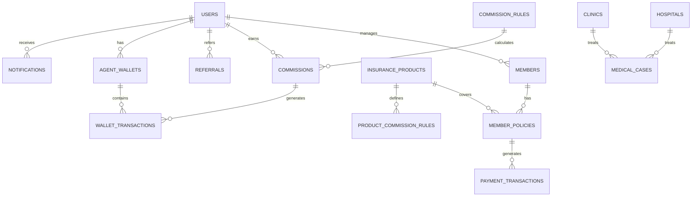

# 🏥 KH Holdings Insurance Agent Management System

<div align="center">


**Professional Insurance Agent Management System with Advanced MLM Commission Structure**

[](https://nextjs.org/)
[](https://laravel.com/)
[](https://www.typescriptlang.org/)
[](https://tailwindcss.com/)
[](https://www.docker.com/)

**Developed by:** Faiz Nasir  
**Owned By:** KH Holdings Sdn Bhd

</div>

---

## 📋 Table of Contents

- [🚀 System Overview](#-system-overview)
- [✨ Core Features](#-core-features)
- [🏗️ System Architecture](#️-system-architecture)
- [💰 Commission System (Detailed)](#-commission-system-detailed)
- [🛠️ Technology Stack](#️-technology-stack)
- [📱 Frontend Features](#-frontend-features)
- [🔧 Backend Features](#-backend-features)
- [💾 Database Schema](#-database-schema)
- [🔄 Business Flows](#-business-flows)
- [🚀 Getting Started](#-getting-started)
- [🐳 Docker Setup](#-docker-setup)
- [📊 API Documentation](#-api-documentation)
- [🔐 Security Features](#-security-features)
- [📈 Business Intelligence](#-business-intelligence)
- [🎯 Use Cases](#-use-cases)
- [🔄 Development Workflow](#-development-workflow)
- [📝 Contributing](#-contributing)
- [📄 License](#-license)

---

## 🚀 System Overview

The **KH Holdings Insurance Agent Management System** is a comprehensive, enterprise-grade platform designed to revolutionize insurance operations through advanced agent management, member services, and sophisticated MLM (Multi-Level Marketing) commission structures. This system serves as the backbone for insurance agents to manage their portfolios, track commissions, and provide exceptional service to policyholders.

### 🎯 **Business Purpose**
- **Agent Management**: Centralized control of insurance agents with hierarchical MLM structures
- **Member Services**: Comprehensive policy management and customer relationship tools
- **Commission Tracking**: Advanced MLM commission calculation and distribution system
- **Healthcare Integration**: Seamless connection with hospitals, clinics, and medical facilities
- **Financial Operations**: Payment processing, mandate management, and transaction tracking
- **Real-time Notifications**: Comprehensive notification system for all important events

### 🌟 **Key Value Propositions**
- **Automated Commission Processing**: Real-time commission calculation and distribution
- **Multi-tier MLM Structure**: Up to 5-level hierarchical commission system
- **Comprehensive Dashboard**: Real-time analytics and performance tracking
- **Mobile-First Design**: Responsive design optimized for all devices
- **Enterprise Security**: Bank-level security with multi-factor authentication
- **Scalable Architecture**: Built to handle thousands of agents and members

---

## ✨ Core Features

### 🎨 **Modern User Experience**
- **Responsive Design**: Mobile-first approach with seamless cross-device compatibility
- **Interactive UI**: Smooth animations, transitions, and modern design patterns using Framer Motion
- **Real-time Updates**: Dynamic content updates without page refresh
- **Progressive Web App**: Offline capabilities and app-like experience
- **Dark/Light Mode**: Adaptive theming for user preference

### 🔐 **Security & Authentication**
- **Multi-factor Authentication**: TAC (Transaction Authorization Code) verification
- **Role-based Access Control**: Granular permissions for different user types
- **Session Management**: Secure token-based authentication with Laravel Sanctum
- **Data Encryption**: Sensitive information protection and secure transmission
- **API Rate Limiting**: Protection against abuse and DDoS attacks

### 📊 **Advanced Analytics & Reporting**
- **Real-time Dashboard**: Live metrics, performance indicators, and trend analysis
- **Commission Tracking**: Multi-tier MLM commission calculation and reporting
- **Performance Metrics**: Agent performance analysis and goal tracking
- **Business Intelligence**: Comprehensive reporting and data visualization
- **Chart.js Integration**: Interactive charts and graphs for data visualization

### 🔔 **Notification System**
- **Real-time Notifications**: Instant notifications for important events
- **Multiple Notification Types**: Commission, payment, policy, system notifications
- **Notification Bell**: Centralized notification center with unread count
- **Email Integration**: Email notifications for critical events
- **Mobile Push**: Push notifications for mobile users

---

## 🏗️ System Architecture

### **Frontend Architecture (Next.js 15.5.2)**
```
app/
├── (ui)/components/          # Reusable UI components
│   ├── BottomNav.tsx        # Bottom navigation component
│   ├── Modal.tsx            # Modal dialog component
│   ├── LoadingSpinner.tsx   # Loading states
│   ├── PageTransition.tsx   # Page transition animations
│   ├── NotificationBell.tsx # Notification system
│   └── MemberDetails.tsx    # Member management components
├── contexts/                 # React context providers
│   └── AuthContext.tsx      # Authentication context
├── services/                 # API service layer
│   └── api.ts              # Centralized API service
├── dashboard/                # Agent dashboard
├── profile/                  # User profile management
├── explore/                  # Product exploration
├── hospitals/                # Healthcare facility management
├── clinics/                  # Clinic management
├── agent-wallet/             # Agent wallet management
├── register-client/          # Client registration
├── register-external/        # External registration
└── medical-insurance/        # Medical insurance management
```

### **Backend Architecture (Laravel 12.0)**
```
backend/
├── app/
│   ├── Http/Controllers/     # API and Admin controllers
│   │   ├── Api/             # API controllers
│   │   │   ├── AuthController.php
│   │   │   ├── DashboardController.php
│   │   │   ├── MemberController.php
│   │   │   ├── CommissionController.php
│   │   │   ├── PaymentController.php
│   │   │   ├── NotificationController.php
│   │   │   └── AgentWalletController.php
│   │   └── Admin/           # Admin panel controllers
│   │       ├── UserController.php
│   │       ├── MemberController.php
│   │       ├── CommissionController.php
│   │       ├── PaymentController.php
│   │       └── WalletController.php
│   ├── Models/               # Eloquent ORM models
│   │   ├── User.php         # Agent model
│   │   ├── Member.php       # Member model
│   │   ├── Commission.php   # Commission model
│   │   ├── AgentWallet.php  # Agent wallet model
│   │   └── Notification.php # Notification model
│   ├── Services/             # Business logic services
│   │   ├── CommissionAutomationService.php
│   │   ├── WalletService.php
│   │   └── NotificationService.php
│   ├── Jobs/                 # Background job processing
│   │   ├── CalculateCommissionJob.php
│   │   └── ProcessMonthlyCommissionJob.php
│   └── Console/Commands/     # Artisan commands
│       ├── ProcessExpiredPolicies.php
│       ├── SendRenewalReminders.php
│       └── ProcessRenewalCommissions.php
├── database/
│   ├── migrations/           # Database schema definitions
│   ├── seeders/              # Sample data population
│   └── factories/            # Model factories for testing
└── routes/                   # API and web route definitions
    ├── api.php              # API routes
    └── web.php              # Admin panel routes
```

### **Database Architecture**
```
Core Tables:
├── users                     # Insurance agents with MLM structure
├── members                   # Policyholders and customers
├── insurance_products        # Available insurance products
├── member_policies           # Active insurance policies
├── medical_insurance_policies # Medical insurance policies
├── commissions               # MLM commission records
├── commission_rules          # Commission calculation rules
├── product_commission_rules  # Product-specific commission rules
├── payment_transactions      # Financial transactions
├── agent_wallets             # Agent wallet balances
├── wallet_transactions       # Wallet transaction history
├── notifications             # System notifications
├── hospitals                 # Healthcare facilities
├── clinics                   # Medical clinics
├── medical_cases             # Claims and medical records
├── payment_mandates          # Recurring payment mandates
└── withdrawal_requests       # Agent withdrawal requests
```

---

## 💰 Commission System (Detailed)

### **🏆 Commission System Overview**

The commission system is the heart of the platform, implementing a sophisticated 5-tier MLM structure that automatically calculates, processes, and distributes commissions in real-time. This system ensures fair compensation for all agents in the network hierarchy.

### **📊 Commission Structure**

#### **Tier Levels (5-Tier MLM Structure)**
```
Tier 1 (Direct Agent):    15% - 50% commission
Tier 2 (Referrer):        10% - 20% commission  
Tier 3 (Referrer's Referrer): 5% - 10% commission
Tier 4:                   3% - 5% commission
Tier 5:                   2% - 3% commission
```

#### **Commission Types**
- **Direct Commission**: Earned by the agent who made the sale
- **Referral Commission**: Earned by agents in the upline network
- **Renewal Commission**: Earned when policies are renewed
- **Bonus Commission**: Special incentives and performance bonuses

### **🔄 Commission Processing Flow**

#### **1. Trigger Events**
Commissions are automatically triggered when:
- ✅ **Medical Insurance Payment Success** → `processMedicalInsuranceCommission()`
- ✅ **Member Policy Payment Success** → `processPolicyCommission()`
- ✅ **Policy Renewal** → `processRenewalCommission()`
- ✅ **Admin Payment Creation** → Manual commission processing

#### **2. Network Level Calculation**
The system builds a **5-level upline network**:

```php
// Network Level Building Algorithm
protected function getAgentNetworkLevels($agentId)
{
    $networkLevels = [];
    $currentAgentId = $agentId;
    $level = 1;

    while ($currentAgentId && $level <= 5) {
        $networkLevels[$level] = $currentAgentId;
        
        // Get the referrer (parent agent)
        $member = Member::where('user_id', $currentAgentId)->first();
        if ($member && $member->referrer_id) {
            $currentAgentId = $member->referrer_id;
        } else {
            break;
        }
        
        $level++;
    }

    return $networkLevels;
}
```

#### **3. Commission Rule Matching**
For each level, the system:
1. **Finds matching rules** based on:
   - Plan name/type (Medical Card, Road Tax, Hibah, Travel PA)
   - Payment frequency (monthly, yearly, one-time)
   - Tier level (1-5)
   - Commission type (percentage or fixed)

2. **Calculates commission amount**:
   ```php
   // Commission Calculation Logic
   public function calculateCommission($baseAmount = null)
   {
       if ($this->commission_type === 'percentage') {
           $amount = $baseAmount ?? $this->base_amount;
           return ($amount * $this->commission_percentage) / 100;
       }
       
       return $this->commission_amount;
   }
   ```

#### **4. Commission Creation & Processing**
```php
// Commission Record Creation
$commission = Commission::create([
    'user_id' => $agentId,
    'product_id' => $productId,
    'policy_id' => $policyId,
    'tier_level' => $tierLevel,
    'commission_type' => $commissionType,
    'base_amount' => $baseAmount,
    'commission_percentage' => $percentage,
    'commission_amount' => $calculatedAmount,
    'payment_frequency' => $frequency,
    'month' => now()->month,
    'year' => now()->year,
    'status' => 'pending',
    'notes' => "Auto-generated commission for {$planName} - Tier {$tierLevel}",
]);
```

#### **5. Wallet Integration & Payment**
When commission is **paid**:
- ✅ **Updates agent wallet balance**
- ✅ **Creates wallet transaction record**
- ✅ **Sends notification to agent**
- ✅ **Marks commission as paid**
- ✅ **Updates pending commission tracking**

### **🤖 Commission Automation Features**

#### **Real-time Processing**
```php
// Immediate commission processing on payment success
$commissionService->processMedicalInsuranceCommission($registrationId);
$commissionService->processPolicyCommission($policyId);
```

#### **Queue-based Processing**
```php
// Heavy calculations run in background
CalculateCommissionJob::dispatch($transaction);
ProcessMonthlyCommissionJob::dispatch($month, $year);
```

#### **Scheduled Automation**
```php
// Laravel Scheduler Configuration
$schedule->command('policies:process-expired')->dailyAt('02:00');
$schedule->command('policies:send-renewal-reminders')->dailyAt('09:00');
$schedule->command('policies:process-renewal-commissions')->hourly();
$schedule->command('queue:work --stop-when-empty')->dailyAt('03:00');
```

### **📈 Commission Types & Rules**

#### **Medical Insurance Commissions**
```
Basic Medical Plan:
├── Tier 1: 15% of premium
├── Tier 2: 10% of premium
├── Tier 3: 5% of premium
├── Tier 4: 3% of premium
└── Tier 5: 2% of premium

Premium Medical Plan:
├── Tier 1: 20% of premium
├── Tier 2: 15% of premium
├── Tier 3: 10% of premium
├── Tier 4: 5% of premium
└── Tier 5: 3% of premium
```

#### **Road Tax Commissions**
```
Road Tax (All Tiers):
├── Tier 1: 50% of premium
├── Tier 2: 20% of premium
├── Tier 3: 10% of premium
├── Tier 4: 5% of premium
└── Tier 5: 3% of premium
```

#### **Hibah Plan Commissions**
```
Hibah Plans:
├── Tier 1: 11.11% - 16% of premium
├── Tier 2: 2.22% - 10% of premium
├── Tier 3: 2.22% - 10% of premium
├── Tier 4: 1.33% - 2.13% of premium
└── Tier 5: 0.89% - 1.28% of premium
```

### **💼 Commission Management Features**

#### **Admin Commission Management**
- **Commission Dashboard**: View all commissions by status and agent
- **Bulk Payment Processing**: Process multiple commissions at once
- **Commission Reports**: Detailed analytics and reporting
- **Rule Management**: Create and modify commission rules
- **Payment Tracking**: Track commission payments and status

#### **Agent Commission Tracking**
- **My Commissions**: View personal commission history
- **Commission Summary**: Monthly and yearly summaries
- **Real-time Updates**: Live commission notifications
- **Payment History**: Track commission payments
- **Performance Metrics**: Commission performance analytics

### **🔄 Commission Status Flow**

```
Pending → Processing → Paid
   ↓         ↓         ↓
Created   In Queue   Completed
```

#### **Status Types:**
- **`pending`**: Commission created, awaiting payment
- **`processing`**: Currently being processed
- **`paid`**: Commission paid to agent wallet
- **`cancelled`**: Commission cancelled
- **`failed`**: Processing failed

### **📊 Commission Analytics**

#### **Real-time Metrics**
- **Total Commissions Earned**: Lifetime commission earnings
- **Monthly Commission Target**: Goal tracking and progress
- **Commission Growth**: Month-over-month growth analysis
- **Top Performing Products**: Best-selling products by commission
- **Network Performance**: Downline commission generation

#### **Commission Reports**
- **Agent Performance Report**: Individual agent commission analysis
- **Product Commission Report**: Commission breakdown by product
- **Monthly Commission Summary**: Monthly commission distribution
- **Network Commission Report**: MLM network commission analysis
- **Payment History Report**: Commission payment tracking

---

## 🛠️ Technology Stack

### **Frontend Technologies**
- **Next.js 15.5.2**: React framework with App Router
- **React 19.1.0**: Modern React with concurrent features
- **TypeScript 5.0**: Type-safe JavaScript development
- **Tailwind CSS 4.0**: Utility-first CSS framework
- **Framer Motion**: Advanced animation library
- **Lucide React**: Beautiful icon library
- **Chart.js & React-Chartjs-2**: Interactive data visualization

### **Backend Technologies**
- **Laravel 12.0**: PHP framework with modern features
- **PHP 8.2+**: Latest PHP with performance improvements
- **MySQL 8.0**: Robust relational database
- **Redis**: In-memory caching and session storage
- **Laravel Sanctum**: API authentication system
- **Laravel Horizon**: Queue monitoring and management
- **Laravel Scheduler**: Automated task scheduling

### **Infrastructure & DevOps**
- **Docker**: Containerized development and deployment
- **Nginx**: High-performance web server
- **phpMyAdmin**: Database management interface
- **Queue Workers**: Background job processing
- **Multi-container Architecture**: Scalable microservices approach

---

## 📱 Frontend Features

### **🏠 Agent Dashboard**
- **Performance Metrics**: Real-time commission tracking and goal progress
- **Member Management**: Add, edit, and manage policyholder information
- **Quick Actions**: Streamlined workflows for common tasks
- **Notification Center**: Important updates and alerts with real-time updates
- **Recent Activities**: Live feed of recent system activities
- **Chart Visualizations**: Interactive charts for performance data

### **👤 Profile Management**
- **Account Overview**: Comprehensive account information with charts
- **Referrer Network**: MLM network visualization and management
- **Bank Information**: Secure banking details management
- **Commission Tracking**: Personal commission history and analytics
- **Medical Insurance**: Client management and policy tracking
- **Settings**: Profile and security settings

### **👥 Member Management**
- **Profile Management**: Comprehensive customer information storage
- **Policy Tracking**: Active policy monitoring and renewal reminders
- **Payment History**: Transaction records and payment status
- **Document Management**: Policy documents and certificates
- **Client Cards**: Downloadable client identification cards

### **🔍 Product Exploration**
- **Insurance Products**: Detailed product information and pricing
- **Coverage Details**: Comprehensive policy coverage explanations
- **Premium Calculator**: Dynamic pricing based on selected options
- **Application Process**: Streamlined policy application workflow
- **Plan Comparison**: Side-by-side plan comparison

### **🏥 Healthcare Integration**
- **Hospital Directory**: Comprehensive healthcare facility database
- **Clinic Management**: Medical facility information and services
- **Medical Case Tracking**: Claims processing and case management
- **Referral System**: Healthcare provider recommendations
- **Search & Filter**: Advanced search capabilities

### **💰 Agent Wallet**
- **Balance Overview**: Real-time wallet balance and transaction history
- **Withdrawal Requests**: Submit and track withdrawal requests
- **Transaction History**: Detailed transaction records
- **Commission Tracking**: Commission payments and pending amounts

---

## 🔧 Backend Features

### **🔌 API Management**
- **RESTful APIs**: Standardized API endpoints for all operations
- **Authentication**: Secure token-based authentication system
- **Rate Limiting**: API usage control and abuse prevention
- **Validation**: Comprehensive input validation and sanitization
- **Error Handling**: Robust error handling and logging

### **💼 Business Logic Services**
- **Commission Calculation**: Advanced MLM commission algorithms
- **Payment Processing**: Secure financial transaction handling
- **Policy Management**: Insurance policy lifecycle management
- **Reporting Engine**: Comprehensive business intelligence tools
- **Notification System**: Real-time notification management
- **Wallet Management**: Agent wallet operations and tracking

### **⚙️ Background Processing**
- **Queue Management**: Asynchronous task processing
- **Commission Jobs**: Automated commission calculation
- **Payment Processing**: Scheduled payment execution
- **Report Generation**: Automated report creation and distribution
- **Policy Expiration**: Automated policy lifecycle management

### **🔐 Admin Panel**
- **User Management**: Complete agent and member management
- **Commission Management**: Commission processing and tracking
- **Payment Management**: Payment processing and reconciliation
- **Wallet Management**: Agent wallet oversight
- **Report Generation**: Business intelligence and analytics
- **System Configuration**: Platform settings and configuration

---

## 💾 Database Schema

### **Core Entity Relationships**



### **Key Tables Structure**

#### **Users Table (Insurance Agents)**
- **MLM Structure**: Hierarchical agent organization with referrer relationships
- **Commission Tracking**: Performance metrics and earnings
- **Banking Information**: Payment and commission distribution
- **Status Management**: Active, suspended, or terminated status
- **Authentication**: Secure login and session management

#### **Members Table (Policyholders)**
- **Personal Information**: Complete customer profiles
- **Emergency Contacts**: Safety and support information
- **Policy Relationships**: Active insurance coverage
- **Financial Status**: Balance and payment history
- **Agent Assignment**: Assigned agent and referral tracking

#### **Commissions Table**
- **Commission Details**: Amount, percentage, and calculation details
- **Tier Information**: MLM tier level and network position
- **Status Tracking**: Pending, processing, paid, cancelled, failed
- **Payment Information**: Payment dates and methods
- **Audit Trail**: Complete commission history and tracking

#### **Agent Wallets Table**
- **Balance Management**: Current balance and pending amounts
- **Transaction History**: Complete transaction records
- **Withdrawal Tracking**: Withdrawal requests and processing
- **Commission Integration**: Direct commission payment integration

#### **Notifications Table**
- **Notification Types**: Commission, payment, policy, system notifications
- **User Targeting**: Specific user notification delivery
- **Status Tracking**: Read, unread, and action status
- **Rich Content**: Detailed notification content and actions

---

## 🔄 Business Flows

### **🔄 Agent Registration Flow**
```
1. Agent Registration → 2. TAC Verification → 3. Profile Setup → 4. Bank Info → 5. Activation
```

### **🔄 Member Registration Flow**
```
1. Agent Login → 2. Add Member → 3. Policy Selection → 4. Payment Processing → 5. Commission Generation
```

### **🔄 Commission Processing Flow**
```
1. Payment Success → 2. Network Analysis → 3. Rule Matching → 4. Commission Creation → 5. Wallet Payment → 6. Notification
```

### **🔄 Policy Lifecycle Flow**
```
1. Policy Creation → 2. Payment Processing → 3. Active Status → 4. Renewal Reminders → 5. Expiration → 6. Renewal/Expiry
```

### **🔄 Payment Processing Flow**
```
1. Payment Initiation → 2. Gateway Processing → 3. Success/Failure → 4. Commission Trigger → 5. Wallet Update → 6. Notification
```

---

## 🚀 Getting Started

### **Prerequisites**
- **Node.js 18+**: For frontend development
- **PHP 8.2+**: For backend development
- **Composer**: PHP dependency management
- **Docker & Docker Compose**: Containerized development environment
- **Git**: Version control system

### **Quick Start with Docker**

1. **Clone the Repository**
   ```bash
   git clone <repository-url>
   cd kh_holdings_insurance_agent
   ```

2. **Start the Development Environment**
   ```bash
   docker-compose up -d
   ```

3. **Access the Applications**
   - **Frontend**: http://localhost:3000
   - **Backend API**: http://localhost:8000
   - **Admin Panel**: http://localhost:8000/admin
   - **phpMyAdmin**: http://localhost:8080

4. **Install Dependencies**
   ```bash
   # Frontend dependencies
   npm install
   
   # Backend dependencies (inside container)
   docker exec -it khi_backend composer install
   ```

5. **Database Setup**
   ```bash
   # Run migrations
   docker exec -it khi_backend php artisan migrate
   
   # Seed sample data
   docker exec -it khi_backend php artisan db:seed
   ```

6. **Start Development Servers**
   ```bash
   # Frontend development
   npm run dev
   
   # Backend development (inside container)
   docker exec -it khi_backend php artisan serve
   ```

---

## 🐳 Docker Setup

### **Container Architecture**
```yaml
services:
  app:                    # Laravel Backend
    container_name: khi_backend
    ports: 8000:80
    environment: Database & Redis configuration
  
  webserver:             # Nginx Web Server
    container_name: khh_nginx
    ports: 8000:80
    volumes: Backend files & Nginx config
  
  db:                    # MySQL Database
    container_name: khh_mysql
    ports: 3306:3306
    environment: Database credentials
  
  phpmyadmin:            # Database Management
    container_name: khh_phpmyadmin
    ports: 8080:80
    environment: PMA configuration
  
  redis:                 # Cache & Session Storage
    container_name: khh_redis
    ports: 6379:6379
  
  worker:                # Queue Processing
    container_name: khh_worker
    command: Queue worker for background jobs
```

### **Environment Configuration**
```bash
# Database Configuration
DB_CONNECTION=mysql
DB_HOST=db
DB_DATABASE=kh_holdings_insurance
DB_USERNAME=khi_users
DB_PASSWORD=khh_secure_password_2024

# Redis Configuration
REDIS_HOST=redis
REDIS_PORT=6379

# Application Configuration
APP_ENV=local
APP_DEBUG=true
APP_URL=http://localhost:8000
```

---

## 📊 API Documentation

### **Authentication Endpoints**
```http
POST /api/auth/login          # Agent login
POST /api/auth/register       # Agent registration
POST /api/auth/forgot-password # Password recovery
GET  /api/auth/me            # Get current user
POST /api/auth/logout        # User logout
```

### **Dashboard Endpoints**
```http
GET /api/dashboard            # Dashboard overview
GET /api/dashboard/stats      # Performance statistics
GET /api/dashboard/activities # Recent activities
```

### **Member Management**
```http
GET    /api/members           # List members
POST   /api/members           # Create member
GET    /api/members/{id}      # Get member details
PUT    /api/members/{id}      # Update member
DELETE /api/members/{id}      # Delete member
```

### **Commission Management**
```http
GET    /api/commissions       # List commissions
GET    /api/commissions/my-commissions # My commissions
GET    /api/commissions/summary # Commission summary
GET    /api/commissions/history # Commission history
```

### **Wallet Management**
```http
GET    /api/wallet            # Wallet overview
GET    /api/wallet/transactions # Transaction history
POST   /api/wallet/withdraw   # Submit withdrawal request
```

### **Notification Management**
```http
GET    /api/notifications     # Get notifications
GET    /api/notifications/unread-count # Unread count
POST   /api/notifications/{id}/read # Mark as read
POST   /api/notifications/mark-all-read # Mark all as read
DELETE /api/notifications/{id} # Delete notification
```

---

## 🔐 Security Features

### **Authentication & Authorization**
- **Multi-factor Authentication**: TAC verification for sensitive operations
- **Session Management**: Secure token-based sessions with expiration
- **Role-based Access**: Granular permissions for different user types
- **Password Security**: Strong password policies and hashing

### **Data Protection**
- **Input Validation**: Comprehensive data sanitization and validation
- **SQL Injection Prevention**: Parameterized queries and ORM protection
- **XSS Protection**: Output encoding and content security policies
- **CSRF Protection**: Cross-site request forgery prevention

### **API Security**
- **Rate Limiting**: API usage control and abuse prevention
- **Token Validation**: Secure API token management
- **Request Signing**: Cryptographic request verification
- **Audit Logging**: Comprehensive security event tracking

---

## 📈 Business Intelligence

### **Real-time Analytics**
- **Dashboard Metrics**: Live performance indicators
- **Commission Tracking**: Real-time commission calculations
- **Member Analytics**: Member growth and retention metrics
- **Payment Analytics**: Payment success rates and trends

### **Reporting System**
- **Agent Performance Reports**: Individual agent analytics
- **Commission Reports**: Detailed commission breakdowns
- **Member Reports**: Member demographics and behavior
- **Financial Reports**: Revenue and payment analytics

### **Data Visualization**
- **Chart.js Integration**: Interactive charts and graphs
- **Real-time Updates**: Live data updates
- **Export Capabilities**: PDF and Excel export options
- **Custom Dashboards**: Personalized analytics views

---

## 🎯 Use Cases

### **Insurance Agents**
1. **Member Registration**: Add new policyholders to the system
2. **Policy Management**: Create and manage insurance policies
3. **Commission Tracking**: Monitor earnings and performance metrics
4. **Customer Service**: Provide support and manage member relationships
5. **Network Management**: Manage downline agents and referrals

### **Administrators**
1. **System Management**: Oversee all system operations
2. **Agent Management**: Monitor and manage agent performance
3. **Commission Processing**: Calculate and distribute commissions
4. **Reporting**: Generate business intelligence reports
5. **Financial Management**: Oversee payments and withdrawals

### **Policyholders**
1. **Policy Access**: View and manage insurance coverage
2. **Payment Management**: Handle premium payments and schedules
3. **Claims Processing**: Submit and track insurance claims
4. **Document Access**: Retrieve policy documents and certificates
5. **Agent Communication**: Contact assigned agents

---

## 🔄 Development Workflow

### **Frontend Development**
```bash
# Development server
npm run dev

# Build for production
npm run build

# Start production server
npm start

# Code linting
npm run lint
```

### **Backend Development**
```bash
# Inside Docker container
docker exec -it khi_backend bash

# Run migrations
php artisan migrate

# Seed database
php artisan db:seed

# Clear caches
php artisan config:clear
php artisan cache:clear

# Run tests
php artisan test
```

### **Database Management**
```bash
# Access phpMyAdmin
http://localhost:8080

# Direct database access
docker exec -it khh_mysql mysql -u khi_users -p

# Backup database
docker exec khi_backend php artisan db:backup

# Restore database
docker exec khi_backend php artisan db:restore
```

---

## 📝 Contributing

### **Development Guidelines**
1. **Code Standards**: Follow Laravel and Next.js best practices
2. **Testing**: Write comprehensive tests for new features
3. **Documentation**: Update documentation for all changes
4. **Code Review**: Submit pull requests for review
5. **Commit Messages**: Use conventional commit format

### **Project Structure**
```
kh_holdings_insurance_agent/
├── app/                     # Next.js frontend application
├── backend/                 # Laravel backend application
├── docker/                  # Docker configuration files
├── public/                  # Static assets and images
├── docs/                    # Project documentation
└── README.md               # This file
```

### **Development Tools**
- **ESLint**: JavaScript/TypeScript code quality
- **PHP CS Fixer**: PHP code formatting
- **Prettier**: Code formatting and consistency
- **Git Hooks**: Pre-commit validation and formatting

---

## 📄 License

This project is proprietary software developed for and owned by **KH Holdings Sdn Bhd**.

**Copyright © 2024 KH Holdings Sdn Bhd. All rights reserved.**

---

## 🤝 Support & Contact

### **Technical Support**
- **Developer**: Faiz Nasir
- **Company**: KH Holdings Sdn Bhd
- **Project**: Insurance Agent Management System

### **Documentation**
- **Frontend**: Next.js App Router documentation
- **Backend**: Laravel 12.x documentation
- **Database**: MySQL 8.0 reference manual
- **Docker**: Docker Compose documentation

### **Issue Reporting**
For technical issues or feature requests, please contact the development team or create an issue in the project repository.

---

<div align="center">

**Built with ❤️ for KH Holdings Insurance**

*Empowering insurance agents with modern technology and automated commission systems*

</div>